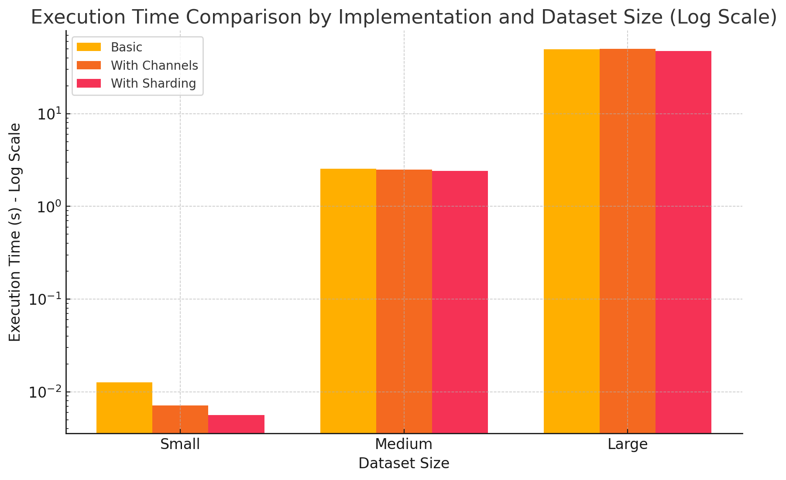
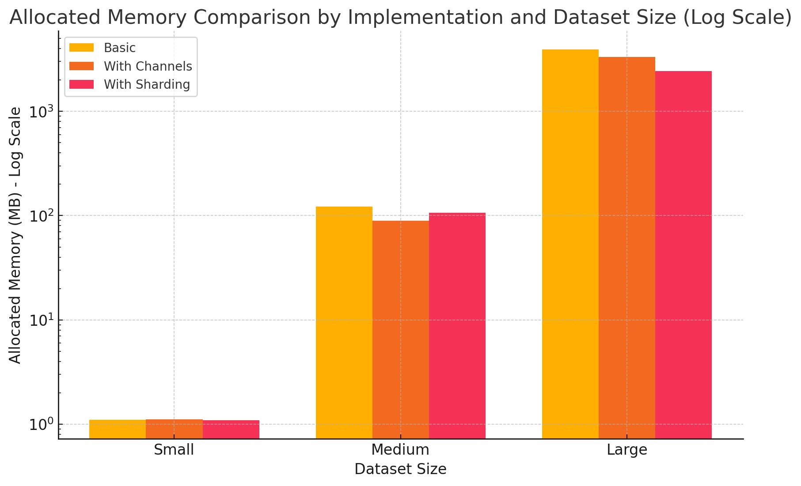

# Go Project Overview

This project is a Go application designed to process streaming data, validate it, and output results in a structured format (CSV file). It is structured to handle concurrent processing, making use of Go's concurrency features like goroutines and channels.

## Project Structure

The project consists of several Go files, each with a specific purpose:

- `main.go`: The entry point of the application. It handles command-line arguments, sets up context and signal handling for graceful shutdown, and coordinates the data processing using goroutines.
- `processing.go`: Contains logic to process the incoming data streams. It defines goroutines for processing records concurrently.
- `types.go`: Defines all the custom types used throughout the project, including structures for user data and event records.
- `utils.go`: Provides utility functions such as validators and helpers for data manipulation and error handling.

## Requirements

- Go 1.15 or higher (due to the use of certain standard library features and modules support)

## Setup and Running

### Building the Project

To build the project, navigate to the project directory and run:

```bash
go build .
```

This command compiles the program and generates an executable in the current directory.

### Running the Application

You can run the application directly using `go run .` Here's how to run it with command-line arguments to specify the input and output files:

```bash
go run . --infile="path/to/inputfile.data" --outfile="path/to/outputfile.csv"
```

Replace `path/to/inputfile.data` and `path/to/outputfile.csv` with the paths to your actual input and output files.


## Implementation Logic
### Initialization:
- Parses flags, opens the input file, and initializes channels for communication.
- Sets up signal handling for clean termination.
- Creates shards (smaller maps) to hold user data, each with its own mutex.

### Concurrent Processing:
- Launches parallel worker goroutines responsible for:
- Reading records from the input channel.
- Determining the appropriate shard based on User ID.
- Locking the shard, processing the record (processRecord), and unlocking.

### Data Stream Handling:
- A separate goroutine reads from the input file and sends records to the shared channel.
- Worker goroutines consume records from this channel.

### Output Generation:

- Merges data from individual shards.
- Sorts user data for consistency.
- Writes summarized results to a CSV file (output).

### Metrics:
- Prints execution time and memory usage.


## Concurrency and Scalability
- Channels: Provide a mechanism for safe communication between goroutines, coordinating data flow.
- Goroutines: Introduce lightweight concurrency, allowing multiple workers to process records simultaneously.
- Sharding: Distributes the map and uses individual mutexes, reducing lock contention and improving scalability in high-concurrency scenarios.


# Benchmark

In order to test different implementations regarding the execution time and memory allocation I implemented the use case with three different approaches.

## 1. Basic Implementation
This approach uses a single map to store user data without synchronization mechanisms. It is the simplest to implement but is highly susceptible to race conditions in a concurrent environment. Due to its single-threaded nature, it won't effectively utilize machines with multiple cores.
## 2. Channels and Global Mutex
This implementation introduces concurrency by using goroutines and channels in Go. However, it relies on a single global mutex to protect the shared map. While this improves performance on multi-core systems compared to the basic implementation, the global mutex can become a performance bottleneck under heavy load, hindering scalability.

## 3. Map Sharding and Individual Mutexes
This approach addresses the limitation of the global mutex by splitting the map into smaller shards, each protected by its own mutex. This strategy reduces lock contention, allowing for better scalability in high-concurrency scenarios. The distributed locking mechanism can improve performance when different parts of the data exhibit distinct access patterns. However, this approach increases implementation complexity.

To effectively visualize and compare the performance and memory usage of your three Go implementations across different dataset sizes, I'll prepare a series of charts. These will include:

**Execution Time Comparison:** This will show the time taken by each implementation for small, medium, and large datasets.

**Allocated Memory Comparison:** This will illustrate the amount of memory initially allocated by each implementation for each 

`Logarithmic scales` will help visualize the differences better, especially when the values vary significantly.Using logarithmic scales on both the execution time and allocated memory graphs makes it easier to compare the smaller datasets alongside the much larger ones.

Data Sets
* Small  - `messages.1.data`
* Medium - `messages.2.data`
* Large - `messages.3.data`


#### Table 1: Performance Results - Basic Implementation
| Dataset Size | Execution Time | Allocated Memory | System Memory |
|--------------|----------------|------------------|---------------|
| Small        | 5.649292ms     | 1118.77 KB       | 7059.02 KB    |
| Medium       | 2.427266458s   | 109204.32 KB     | 160425.05 KB  |
| Large        | 47.3564215s    | 2493692.08 KB    | 4902411.98 KB |

#### Table 2: Performance Results - Channels and Global Mutex
| Dataset Size | Execution Time | Allocated Memory | System Memory |
|--------------|----------------|------------------|---------------|
| Small        | 12.699209ms    | 1126.45 KB       | 7059.02 KB    |
| Medium       | 2.5448555s     | 124711.05 KB     | 156137.05 KB  |
| Large        | 49.752667959s  | 4009411.55 KB    | 4714946.94 KB |

#### Table 3: Performance Results - Sharding and Individual Mutexes
| Dataset Size | Execution Time | Allocated Memory | System Memory |
|--------------|----------------|------------------|---------------|
| Small        | 7.106583ms     | 1136.03 KB       | 6803.02 KB    |
| Medium       | 2.485280292s   | 91240.86 KB      | 168169.05 KB  |
| Large        | 50.014926542s  | 3404685.38 KB    | 4700226.94 KB |


&nbsp;





## Observations with Logarithmic Scale:
### Execution Time (Log Scale):
For small and medium datasets, the differences among the implementations are more discernible. The sharding approach remains consistently the fastest, emphasizing its efficiency even at smaller scales.
The improvement in execution time from basic to more advanced implementations is clearer with the logarithmic scale.


### Allocated Memory (Log Scale):
The memory usage differences are accentuated, especially for the medium and large datasets.
It's apparent that the basic implementation consumes significantly more memory than the other two methods for medium and large datasets, while for small datasets, the differences are minimal but still visible.

## Details

### Execution Time Comparison:
The 'Basic' implementation generally performs better in execution time across all dataset sizes, particularly notable in the large dataset.
Both the 'Channels & Global Mutex' and 'Sharding & Individual Mutexes' implementations show increased execution times as the dataset grows, with 'Channels & Global Mutex' slightly slower in the medium and large datasets.
### Allocated Memory Comparison:
'Basic' implementation has the least memory allocation in small and medium datasets but escalates considerably in the large dataset.
'Channels & Global Mutex' has the highest memory allocation in the large dataset, indicating less efficient memory usage.
'Sharding & Individual Mutexes' balances between the other two, showing moderate memory usage.
### Total Allocated Memory Comparison:
Similar trends are seen in the allocated memory chart, with 'Channels & Global Mutex' and 'Sharding & Individual Mutexes' consuming more memory overall, especially noticeable in the large dataset.
### System Memory Usage Comparison:
All implementations increase their system memory usage with larger datasets.
'Channels & Global Mutex' tends to use less system memory in the large dataset compared to 'Basic' but is comparable to 'Sharding & Individual Mutexes'.

### Conclusion
The 'Basic' implementation, while simple, provides the best execution time, especially for large datasets. However, it has high spikes in memory usage as the dataset size increases.
The 'Channels & Global Mutex' implementation generally uses more memory and slightly longer execution times than the 'Basic' across all dataset sizes, suggesting it may not be the most efficient choice.
'Sharding & Individual Mutexes' offers a balance, with moderate memory usage and reasonable execution times, but does not consistently outperform the 'Basic' implementation in any specific metric.

Given these results, if execution time is the primary concern, the 'Basic' implementation seems the most efficient, particularly for handling large datasets. However, for applications where memory usage is also a critical factor, 'Sharding & Individual Mutexes' could be considered as it offers a more balanced approach between performance and memory consumption.

